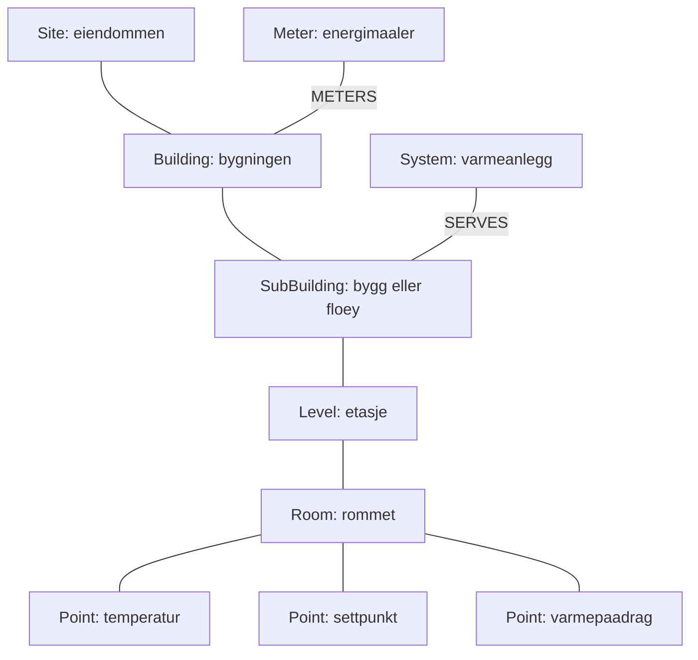

# Brukerveiledning: Kunnskapsgrafen

*Denne brukerveiledning er ment for deg som skal bruke grafen. Instruksene antar at du er personell innenfor drift, forvaltning og energirådgivere. Å forstå og navigere kunnskapsgrafen krever ingen programmeringskunnskaper. Hvordan grafen bygges, står i
`BRUKERVEILEDNING_PIPELINE.md`.*

---

## 1. Hva er kunnskapsgrafen?

Kunnskapsgrafen er byggets tekniske hukommelse, samlet på ett sted: hvilke
bygg og etasjer som finnes, hvilke rom som har hvilken oppvarming, hvilke
systemer som betjener hva, og hvilke målere som måler hva. Informasjonen er
hentet fra byggets SD-anlegg og deretter kontrollert manuelt gjennom UI'en,
gjennom punktlister og mot faktiske måledata. Hver opplysning bærer med seg *hvor den kommer fra* og *hvor sikker den er*.

## 2. Slik åpner du den
**NB!** Grafen kan åpnes i flere forskjellige applikasjoner, men disse brukerveiledningene tar utgangspunkt i at du bruker applikasjonen **Neo4j Desktop**. Instruksjoner for innstallering følger ikke med her.

1. Start **Neo4j Desktop** og åpne databasen (standard: `neo4j` på
   `localhost`).
2. Åpne **Neo4j Browser** og lim inn spørringer fra kapittel 5.

Er databasen tom, må grafen importeres først — se
`BRUKERVEILEDNING_PIPELINE.md`, kapittel 4.

## 3. Hva nodene betyr

| Nodetype | Betyr | Eksempel |
|---|---|---|
| `Site` | Eiendommen/tomten | Skolen som helhet |
| `Building` | Bygningen | Hovedbygningen |
| `SubBuilding` | Bygg/fløy innenfor eiendommen | «Bygg 3» |
| `Level` | Etasje | «Plan 2», «U1» |
| `Room` | Et rom med romstyring | «Rom 101» |
| `Zone` | Termisk sone styrt av et system (ikke enkeltrom) | Sonen til et ventilasjonsaggregat |
| `System` | Teknisk system | Varmeanlegg, ventilasjonsaggregat |
| `Meter` | Energimåler (hoved- eller undermåler) | Fjernvarmemåler |
| `Point` | Ett målepunkt/signal | Temperaturføler i et rom |

Slik henger de sammen (forenklet):



De tre punktene under rommet er **romvarme-trippelen**: målt temperatur,
ønsket temperatur (settpunkt) og pådraget til varmekilden. Rom som har alle
tre, kan styres og analyseres og er derfor nyttige for å regne energifleksibilitet.

## 4. Grafens riktighet

Info i grafen er hentet fra SD-anlegget. Jeg har altså ikke manuelt verifisert om det stemmer at radiator X tilhører rom Y, osv. **Dersom SD-anlegget har feil, vil grafen kunne ha tilsvarende feil.** Hver opplysning i grafen har et
konfidensnivå, synlig som egenskaper på noden (klikk på en node for å se
dem):

| Nivå | Betyr |
|---|---|
| `verified` | Kontrollert mot SD-anleggets egne tekster/verdier eller mot måledata |
| `curated` | Lest ut av plantegninger/skjermbilder |
| `assumed` | Arvet fra bygget rommet står i — ikke bekreftet på romnivå |

I tillegg skiller grafen mellom to *kilder* til kunnskap som aldri
overskriver hverandre:

- **Kuraterte fakta** — f.eks. `heatingType: radiator` med `heatingSource`
  (hvor det ble sett) og `heatingConfidence`.
- **Datafakta** — regnet ut fra et års måledata: `regime` (styrer ventilen
  av/på eller gradvis), `dataVerdict` (hva dataene alene kan si om
  varmetypen) og `qualityFlags` (f.eks. `dead_gain` = pådraget rørte seg
  aldri på et helt år).

To varsler å se etter:

- `heatingConflict: true` på et bygg betyr at kildene er uenige om
  varmetypen — beskrivelsen på noden forklarer konflikten.
- `qualityFlags` på et rom betyr at måledataene oppfører seg rart.

## 5. Hvordan visualisere grafen

Følgende er spørringer du kan ime inn i Neo4j Browser for å se den delen av grafen du er interessert i eller tabeller med informasjonen du ønsker å hente frem. 

**Vis meg alt (oversiktsbilde):**
```cypher
MATCH (n) RETURN n LIMIT 100
```

**Hvilke rom finnes i hvert bygg, og hva slags oppvarming har de?**
```cypher
MATCH (r:Room)-[:LOCATED_IN]->(l:Level)-[:PART_OF]->(sb:SubBuilding)
RETURN sb.name AS bygg, l.label AS etasje, r.name AS rom,
       r.heatingType AS varme, r.heatingConfidence AS konfidens
ORDER BY bygg, etasje, rom
```

**Hvilke rom er fortsatt bare antatt (ikke bekreftet)?**
```cypher
MATCH (r:Room) WHERE r.heatingConfidence = 'assumed'
RETURN r.name AS rom, r.heatingType AS antatt_varme
```

**Er det rom med rare måledata (f.eks. dødt pådrag)?**
```cypher
MATCH (r:Room) WHERE r.qualityFlags IS NOT NULL
RETURN r.name AS rom, r.qualityFlags AS flagg, r.regime AS regime
```

**Hva betjener varmeanlegget / hva rammes hvis et system stopper?**
```cypher
MATCH (s:System)-[:SERVES]->(mottaker)
RETURN s.name AS system, mottaker.name AS betjener
```

**Hvilke rom mangler romstyring av varme?**
```cypher
MATCH (r:Room) WHERE r.hasHeating = false
RETURN r.name AS rom
```

**Hvordan henger målerne sammen (hoved- og undermålere)?**
```cypher
MATCH (m:Meter)-[:SUBMETER_OF]->(hoved:Meter)
RETURN hoved.name AS hovedmaaler, m.name AS undermaaler
```

**Er kildene i konflikt noe sted?**
```cypher
MATCH (n) WHERE n.heatingConflict = true
RETURN n.name AS hvor, n.description AS forklaring
```

## 6. Hva grafen ikke kan svare på

- **Sanntid.** Grafen er et øyeblikksbilde og oppdateres bare når den
  genereres på nytt. Verdier i sanntid hører hjemme i dashbordet, ikke her.
  Grafen *peker* på tidsseriene (egenskapen `csvFile` på rommene), men
  inneholder dem ikke.
- **Rom uten romstyring.** Rom som ikke finnes i SD-anlegget, finnes heller
  ikke her.

Stoler du ikke på en opplysning? Sjekk `*Source`- og
`*Confidence`-egenskapene på noden. Der står alltid hvor den kom fra.
