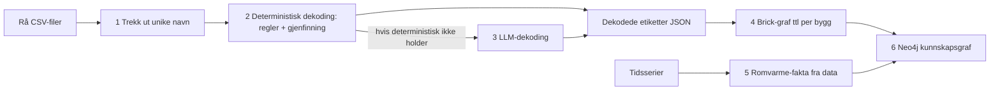

# Brukerveiledning: Fra rådata til kunnskapsgraf

*Denne brukerveiledningen er ment for deg som skal kjøre applikasjonen. Det innebærer å bygge nye grafer eller regenerere
eksisterende. Forutsetter at du kan bruke en terminal. Hvordan du LESER
grafen, står i `BRUKERVEILEDNING_GRAF.md`.*

---

## 1. Hva applikasjonen gjør

Applikasjonen tar ustrukturerte målepunkt-navn fra byggets SD-anlegg
(f.eks. `360.001-RT401`) og gjør dem om til strukturerte, maskinlesbare
fakta. Disse blir til slutt en kunnskapsgraf per bygg i grafvisualiserings-programmet Neo4j.



For å gjøre prosessen billigst mulig prøver Python å dekode det den klarer gjennom regler og gjenfinning. Det som er igjen går til LLM-en (Claude i mitt tilfelle). Alt systemet
lærer, lagres i `knowledge_base/`. Fordi målet er at applikasjonen skal kunne brukes av andre, uavhengig av LLM, skal det ikke være gjennom prompter at systemet lærer.

## 2. Hva du må gi den

1. **Punktnavnene** i `data/raw/` — enten som CSV på formatet i boksen
   under, eller rett og slett som en tekstfil med ett punktnavn per linje
   (en slik liste kan mates rett til `build_batch` i kapittel 3).
   Tidsserieverdier trengs *ikke* for dekoding, men det trengs for
   datakryssjekker og romvarme-analysen (paragraf 4).
2. **Kildetype** per datasett: `kiona`, `bacnet` eller `other` — den styrer
   hvilken grammatikk dekoderen prøver.
3. **Referansedokumentasjon** om merkesystemet ditt (tabeller, standarder,
   leverandørdokumenter): konverter til Markdown og legg under
   `knowledge_base/<navn>_dir/<navn>.md`. LLM-en leser Markdown, ikke PDF
   (`src/PDF-parser/` kan hjelpe med konverteringen).
4. **NS-standardene** (NS 3451, NS 3457-8) er opphavsrettsbeskyttet og
   følger ikke med. Dersom du har du dem, legg dem på plassene beskrevet i
   `README.md`. Alt virker uten dem, men dekodingen kan ikke sitere dem.

> **Krav til CSV-formatet** (for `unique_labels` i kapittel 3): langformat
> uten overskriftsrad, én måling per linje — `punktnavn,tidsstempel,verdi`.
> Verktøyet plukker av de to *siste* komma-feltene (tidsstempel og verdi) og
> beholder resten som punktnavn, så navnet kan inneholde hva som helst, også
> komma. Tidsstempel-formatet er likegyldig (det leses aldri). En eventuell
> overskriftsrad hoppes ikke over — den blir en ufarlig ekstra "etikett" du
> kan slette fra listen. To feller fra norske Excel-eksporter (verktøyet
> varsler om begge):
>
> - **Semikolon-CSV:** norsk Excel eksporterer ofte med `;` — da blir hele
>   linjen stående som "punktnavn". Filen må være ekte komma-separert.
> - **Desimalkomma i verdien** (`21,5`): forskyver kolonnene, så punktnavnet
>   stille blir feil. Bruk desimalpunktum (`21.5`).
>
> **Nødutgangen finnes alltid:** passer ikke formatet, lag en ren tekstfil
> med ett punktnavn per linje (be gjerne LLM-en om konverteringen) og hopp
> rett til `build_batch`-steget.

> **Windows/norske tegn:** kjør alltid med `PYTHONIOENCODING=utf-8`, og les
> alle filer som UTF-8. æ/ø/å i filINNHOLD er greit; filNAVN holdes ASCII.

Ingen byggdata følger med repoet. De innsjekkede eksempelbatchene
(`data/eval/batches/`) lar deg teste hele løypa uten egne data.

## 3. Fra CSV til dekodede etiketter

```bash
# 1. Trekk ut unike etiketter fra CSV-ene dine
python -m src.extract.unique_labels "data/raw/DINE-FILER*.csv" -o labels.txt

# 2. Bygg en dekoder-batch
python -m src.extract.build_batch labels.txt --source-type bacnet \
    -o data/eval/batches/MIN_BATCH/input.jsonl

# 3. Deterministisk dekoding (null LLM-kostnad)
python -m src.decode.deterministic_batch \
    --input data/eval/batches/MIN_BATCH/input.jsonl --out-dir runs/MIN_BATCH
```

Resultatet i `runs/MIN_BATCH/`: `outputs.jsonl` (dekodede etiketter),
`residue.jsonl` (det reglene ikke klarte) og `coverage.md` (les denne
først. Sier noe om hvor bra det gikk?).

**Resten til LLM-en:** *(Denne delen er per (31.07.26) bare testet med Claude. Forhåpentligvis kan man få til gode resultater med andre LLM'er også.)* 

Åpne prosjektet i Claude Code og kjør
`/decode`-ferdigheten på batchen. Den dekoder hver rest-etikett i en ny
agent (Dette sørger for at det ikke er noen "smitte" mellom etiketter) og legger resultatene til
`outputs.jsonl`. *(Har du ikke Claude Code? Se kapittel 7 — alle
LLM-verktøy kan brukes.)* Tynne-men-gyldige dekoder kan berikes tilsvarende:

```bash
python -m src.decode.enrichment --outputs runs/MIN_BATCH/outputs.jsonl \
    --out-dir runs/MIN_BATCH_enrich          # velger kandidater
# ... kjør /enrich i Claude Code ...
python -m src.decode.merge_outputs \
    --deterministic runs/MIN_BATCH/outputs.jsonl \
    --llm runs/MIN_BATCH_enrich/outputs_llm.jsonl \
    --out runs/MIN_BATCH_enrich/outputs_enriched.jsonl
```

(Deterministiske ikke-null-felter vinner alltid ved fletting.)

**Feilsøke én etikett:**

```bash
python -m src.decode.try_label "360.001-RT401" --source-type bacnet
```

**Slik leser du en dekodet etikett:** hvert JSON-objekt har `confidence`
(0–1), `tier` (FULL/PARTIAL/NONE — hvor mye som ble fylt ut) og `reasoning`
(hvorfor, med kildehenvisninger til kunnskapsbasen). Ukjente felter er
`null`. Altså vil systemet aldri gjette. Detaljer: `docs/output_explainer.md` og
`schema/README.md` (tre gjennomarbeidede eksempler i `examples/`).

Har du et fasitsett (`tests/gold/<id>/gold.jsonl`), kjører én kommando hele
løypa med scoring: `python -m src.eval.run_eval --batch MIN_BATCH` — les
`summary.md` i run-mappa. Målemetodikken: `docs/EVALUATION.md`.

## 4. Fra dekodede etiketter til kunnskapsgraf

**Brick-graf** (én Turtle-fil per bygg):

```bash
python -m src.brick.emit_graph --outputs runs/MIN_BATCH/outputs.jsonl \
    --site mittbygg --out-dir runs/MIN_BATCH/graphs

# Rask visuell sjekk (Mermaid-diagram i Markdown):
python -m src.brick.graph_viz runs/MIN_BATCH/graphs/BYGG.ttl -o graf.md
```

**Romvarme-fakta fra tidsserier** (valgfritt, men det er dette som gir
energifleksibilitet): krever én CSV per sone/rom med kolonnene
`Timestamp,T_Actualvalue,T_Setvalue,T_Gain` under
`<rot>/Buildings/<BYGG>/Thermal zone/`. Kjeden:

```bash
python -m src.heating.build_zone_table --root <rot> --buildings <BYGG> \
    -o runs/heating/zone_table.jsonl --cache runs/heating/scan_cache.jsonl
python -m src.heating.gain_regime runs/heating/zone_table.jsonl \
    -o runs/heating/regimes.jsonl
python -m src.heating.step_response --root <rot> --buildings <BYGG>
python -m src.heating.heating_type runs/heating/regimes.jsonl \
    runs/heating/step_summary.jsonl -o runs/heating/heating_types.jsonl
```

Design og metodikk: `docs/ROOM_HEATING_PLAN.md`. Terskler kan justeres i
`knowledge_base/heating_rules.json`.

**Inn i Neo4j:**

```bash
python -m src.heating.neo4j_export --index-dir <indeksmappe> \
    --runs-dir <run-mappe> -o runs/heating/import.cypher
python -m src.heating.neo4j_import --cypher runs/heating/import.cypher
```

Import krever at Neo4j kjører lokalt (`bolt://127.0.0.1:7687`) og at
passordet ligger i miljøvariabelen `NEO4J_PASSWORD` eller i en `.env`-fil.
Indeksmappa inneholder én JSON per bygg med den håndkuraterte
strukturen (bygg, etasjer, rom, systemer, proveniens). Formatet er
dokumentert i docstringen til `src/heating/neo4j_export.py`, og
`knowledge_base/index/` (lokal) er malen.

## 5. Vedlikehold og læring

Systemet blir bedre ved å **samle kunnskap i `knowledge_base/`**, aldri
ved at LLM-en «husker» fra tidligere sessions. Validerte dekoder legges i
`validated_decodes.jsonl` (kun etter menneskelig godkjenning via
`python -m src.profile.promote --approve`), nye regler i
`deterministic_rules.json`. Nye runs beviser at forbedringene
generaliserer — regelen og begrunnelsen står i `docs/EVALUATION.md`.

## 6. Feilsøking

| Symptom | Se |
|---|---|
| Stor `residue.jsonl` (reglene klarer lite) | `docs/tokenizer_failure_modes.md` — kjente hull og policy |
| æ/ø/å blir til rare tegn | UTF-8: `PYTHONIOENCODING=utf-8`, les filer som UTF-8 |
| `neo4j_import` får «connection refused» | Start Neo4j Desktop først |
| Dekoderen setter `null` der du vet svaret | Riktig oppførsel: aldri gjette. Legg kunnskapen i `knowledge_base/`, kjør på nytt |
| Alt annet | `python -m pytest -q` skal være grønn. Er den ikke det, er noe galt lokalt |

## 7. Uten Claude Code: ChatGPT, Codex og andre LLM-verktøy

Applikasjonen er laget LLM-uavhengig: all kunnskap ligger i filer i
`knowledge_base/`, og LLM-en brukes bare som en "prompt inn → JSON
ut"-funksjon uten hukommelse. Claude Code er den *testede og anbefalte*
veien, men den er ikke et krav. To alternative ruter, etter hva slags
verktøy du har:

### A. Agent-verktøy som jobber i prosjektmappen (f.eks. OpenAI Codex)

Verktøy som kan lese filer, skrive filer og kjøre kommandoer i
prosjektmappen brukes i praksis likt som Claude Code — også til
kartleggingsnotat og bygg-indeks. Filen `AGENTS.md` i rotmappen orienterer
slike verktøy (den peker til `CLAUDE.md` og prosedyrene). For dekoding: be
verktøyet følge `.claude/skills/decode/SKILL.md` bokstavelig. Ett krav er
absolutt: **hver etikett skal dekodes i en fersk, isolert modell-kontekst**
— aldri alle i én samtale (kaldstart-regelen, `docs/EVALUATION.md`). Kan
ikke verktøyet garantere det, bruk rute B.

> **GitHub Copilot (VS Code) og lignende:** kan ikke starte isolerte
> del-agenter selv, og prompt-filene er for store til å limes inn i et
> chat-felt. Kombiner rutene: kjør `export`-steget i rute B, og be verktøyet
> — i en NY chat per etikett — lese `prompts/NNN.txt` og skrive KUN
> JSON-svaret til `replies/NNN.txt`. Deretter `collect` som vanlig.

### B. Chat-nettsider (ChatGPT, Gemini, claude.ai i nettleseren)

Kopier-og-lim-ruten. Programmet lager ferdige prompt-filer, du limer dem
inn, og programmet kontrollerer svarene:

```bash
# 1. Lag én ferdig prompt-fil per rest-etikett:
python -m src.decode.manual_batch export \
    --input runs/MIN_BATCH/residue.jsonl --out-dir runs/MIN_BATCH_manual

# 2. For hver fil i prompts/: lim ALT inn i en HELT NY chat (én etikett per
#    chat — aldri gjenbruk en chat!), og lagre svaret som replies/<samme
#    nummer>.txt. Kodegjerder og småprat rundt JSON-en er ufarlig.

# 3. Kontroller svarene og sett sammen resultatet:
python -m src.decode.manual_batch collect --dir runs/MIN_BATCH_manual \
    --deterministic runs/MIN_BATCH/outputs.jsonl \
    --out runs/MIN_BATCH/outputs_full.jsonl
```

`collect` godtar bare svar som består skjemakontrollen og ekko-sjekken av
etiketten; avviste svar får en ferdig korrigert prompt i `retry/`-mappen
(ny chat, overskriv svarfilen, kjør `collect` igjen). Berikelse (kapittel 3)
går samme rute: bruk `enrichment_residue.jsonl` som input, og flett
`outputs_llm.jsonl` med `merge_outputs` som beskrevet der.

**Ærlig merknad:** bare Claude er kvalitetstestet som dekoder-LLM.
Øvingsbatchen `b_synth_s01` med fasit
(`data/synthetic/S01_granlia_answer_key.md`) er laget nettopp for å prøve en
annen LLM: dekod den og se om modellen går i fellene (nr. 23 og 26) før du
stoler på den på et ekte bygg.

