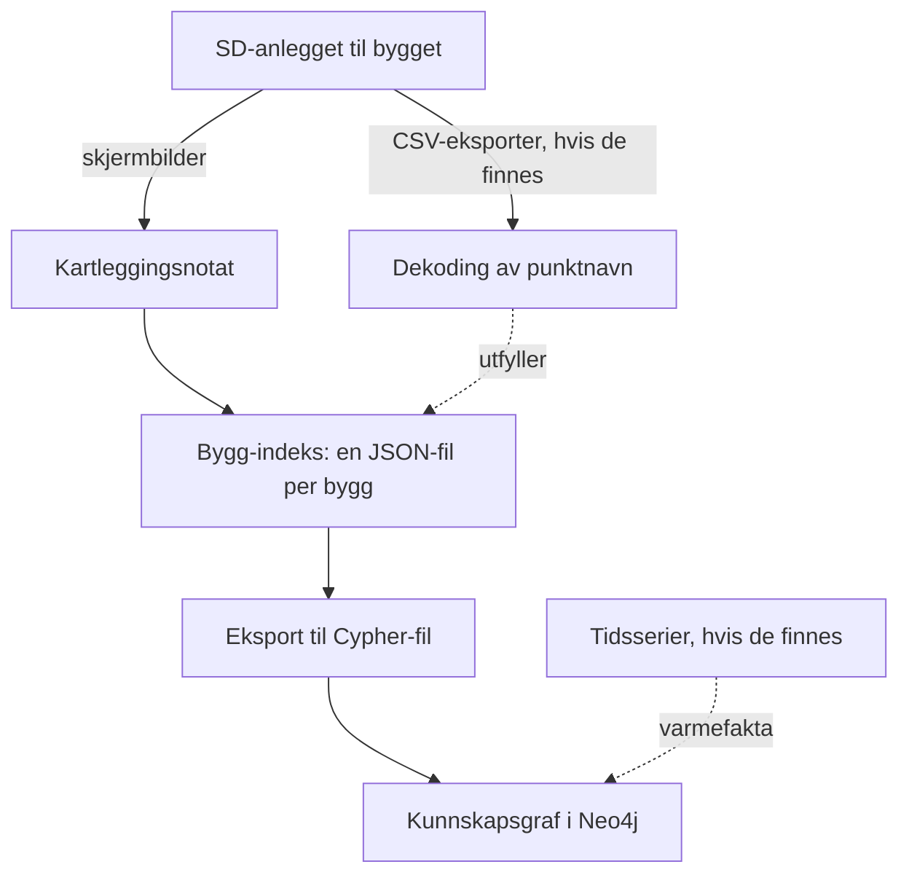

# Opplæring: fra null til kunnskapsgraf for et nytt bygg

*Dette dokumentet er både en kjøreplan for den som skal lære bort applikasjonen
(del A) og en komplett trinn-for-trinn-veiledning som den som skal bruke den
kan beholde og følge på egen hånd (del B). Målgruppen er en som IKKE er
utvikler, men som skal lage kunnskapsgrafer for nye bygg. Alt du trenger å
kunne, er å kopiere kommandoer inn i en terminal — og å bruke Claude Code som
medhjelper der veiledningen sier det.*

Beslektede dokumenter: `BRUKERVEILEDNING_PIPELINE.md` (kortversjonen av
kommandoløypa), `BRUKERVEILEDNING_GRAF.md` (hvordan LESE grafen — ingen
programmering), `HANDOVER.md` (drift av de leverte grafene, engelsk).

---

## Del A — Kjøreplan for den som lærer bort

**Klargjør maskinen FØR første økt** (gjør engangsoppsettet i kapittel 2 selv,
eller sammen som en del av økten hvis dere har tid):

- [ ] Repoet + den lokale bunten (`HANDOVER.md` kap. 2) ligger på maskinen hans
- [ ] Neo4j Desktop installert, database opprettet, Tåsen/Skøyen-grafen importert
      (så det finnes en ferdig graf å vise som "målet")
- [ ] Claude Code installert og innlogget (avklar på forhånd hvilket
      Claude-abonnement han skal bruke)
- [ ] `python -m pytest -q` er grønn på hans maskin

**Forslag til to økter:**

*Økt 1 — forstå og lese (ca. 1,5 time):*
1. Vis den ferdige Tåsen-grafen i Neo4j Browser først. Dette er målet; alt
   annet er veien dit. Bruk spørringene i `BRUKERVEILEDNING_GRAF.md` kap. 5.
2. Gå gjennom "Det store bildet" (kap. 1 under) på tavle/skjerm.
3. Oppvarming (kap. 3): han dekoder én etikett og en hel batch selv.
4. Avslutt med tillitsmodellen: `verified`/`curated`/`assumed` og regelen
   "navn = hypotese, data = test".

*Økt 2 — bygge selv (2–3 timer):*
1. Kjør hele løypa på øvingsbygget **Granlia** (kap. 3.3) — syntetisk, ufarlig,
   og med fasit å sammenligne mot.
2. Start så på det ekte nye bygget (kap. 4) så langt dere kommer: kartlegging
   → indeks → eksport → import → kontroll.

**Pedagogiske regler som virker:**
- **Han skriver alt selv.** Du rører aldri tastaturet. Det som er klikket av
  andre, huskes ikke.
- Når en feilmelding dukker opp: ikke fiks den — slå opp sammen i
  feilsøkingstabellen (kap. 8). Det er ferdigheten han faktisk trenger.
- Lær ham nødutgangen tidlig: *alt* han står fast på kan han spørre Claude
  Code om, på norsk, i prosjektmappen (kap. 1.3).
- Ikke undervis Brick/skjema-detaljer med mindre han spør. Kapittel 4–6 er
  jobben hans; resten er bakgrunn.

---

## Del B — Veiledningen: fra null til kunnskapsgraf

**Liten ordliste** (resten av veiledningen bruker disse uten videre):

| Ord | Betyr her |
|---|---|
| terminal / PowerShell | tekstvinduet du skriver kommandoer i — på Windows heter det PowerShell; vi bruker ordene om hverandre |
| etikett / punktnavn | navnet på ett målepunkt i SD-anlegget, f.eks. `360.001-RT401` — to ord for samme ting |
| CSV | en tabell lagret som ren tekst med komma mellom kolonnene (det Excel kan eksportere) |
| JSON | en strukturert tekstfil som både mennesker og maskiner kan lese; du skal skrive én i kap. 4.4 |
| batch | en bunke etiketter samlet i én fil, så de kan dekodes under ett |
| LLM | KI-språkmodell — her Claude |
| UTF-8 | tegnkodingen som bevarer æ/ø/å; alle filer i prosjektet leses og skrives slik |
| Cypher | Neo4js instruksjonsspråk; eksporten lager en tekstfil med slike instruksjoner |
| «sjekkes inn» / git | å bli del av den delte, offentlige kodebasen — byggdata skal aldri dit |

## 1. Det store bildet

### 1.1 Hva du skal lage

Kunnskapsgrafen er **byggets tekniske hukommelse, samlet på ett sted**: hvilke
bygg og etasjer som finnes, hvilke rom som har hvilken oppvarming, hvilke
systemer som betjener hva, og hvilke målere som måler hva. Hver opplysning
bærer med seg *hvor den kommer fra* og *hvor sikker den er*.

Veien dit:



Ryggraden er alltid den samme: **kartlegg bygget → skriv bygg-indeksen →
eksporter → importer i Neo4j**. De stiplede pilene er tillegg som gjør grafen
rikere når datagrunnlaget finnes, men de er ikke nødvendige for å komme i mål.

### 1.2 Hvordan koden virker (på ett minutt)

Applikasjonen er lagdelt, og prøver alltid **billigst først**:

1. **Uttrekk** — les CSV-filer, plukk ut de unike punktnavnene (etikettene).
2. **Dekoding** — gjør hver etikett om til strukturerte fakta:
   først *regler* (koden kjenner igjen mønstre som `-RT401`), så
   *gjenfinning* (har vi sett en lignende etikett før?), og bare det som er
   igjen går til *LLM-en*. Systemet **gjetter aldri**: ukjente felt blir
   `null`, og hvert svar har en konfidens og en begrunnelse med
   kildehenvisning.
3. **Kunnskapsbasen** (`knowledge_base/`) — alt systemet lærer, lagres her som
   filer: regler, godkjente dekodinger, kodetabeller. Det er **slik** systemet
   blir smartere over tid — aldri ved at LLM-en "husker" fra forrige gang.
4. **Graf** — de strukturerte faktaene + bygg-indeksen blir en kunnskapsgraf
   i Neo4j.
5. **Datakryssjekk** — der tidsserier finnes, testes navnene mot virkelig
   oppførsel ("varme skal korrelere negativt med utetemperatur").
   Grunnregelen i hele prosjektet: **navn = hypotese, data = test.**

### 1.3 Claude Code er medhjelperen din

Du trenger ikke å være utvikler, for du har en med deg som er det. Claude
Code er et program der Claude kan lese filene i prosjektmappen, kjøre
kommandoer for deg og forklare det som skjer. Slik bruker du den:

1. Åpne prosjektmappen (`byggminne`) i Filutforsker, høyreklikk på et
   tomt område i mappen og velg **"Åpne i terminal"**. (Slik åpner du
   PowerShell "i prosjektmappen" — det trikset brukes gjennom hele
   veiledningen.)
2. Skriv `claude` og trykk Enter.
3. Skriv det du lurer på — **på norsk**: *"Forklar hva denne feilmeldingen
   betyr"*, *"Kjør dekode-løypa på batchen min"*, *"Hjelp meg å skrive
   bygg-indeksen for det nye bygget"*.

Prosjektet har en `CLAUDE.md`-fil som gir Claude hele kartet, så den vet hvor
ting ligger og hvilke regler som gjelder. To spesialkommandoer finnes også:
`/decode` (brukes første gang i kap. 3.3) og `/enrich` (kap. 5).

*(Bruker du et annet LLM-verktøy enn Claude Code — ChatGPT, Codex eller
lignende? Alt i denne veiledningen kan fortsatt gjøres; oppskriften står i
`BRUKERVEILEDNING_PIPELINE.md` kapittel 7.)*

**Arbeidsdelingen er alltid:** Claude leser, foreslår og kjører — **du**
godkjenner fakta. Ingen opplysning går inn i grafen uten at et menneske har
sett den og satt riktig sikkerhetsnivå (kap. 4.4).

## 2. Engangsoppsett på din maskin

Gjøres én gang. Punkt for punkt:

1. **Installer Python 3** fra <https://www.python.org/downloads/>. Viktig:
   kryss av **"Add python.exe to PATH"** i installasjonsveiviseren.
2. **Få prosjektet.** Du får `byggminne`-mappen av forrige forvalter,
   enklest som en zip-fil: høyreklikk → **Pakk ut alle**, og legg mappen et
   fast sted, f.eks. `C:\Users\<dittnavn>\byggminne` (helst en mappe som
   *ikke* synkroniseres av OneDrive — prosjektet lager tusenvis av småfiler).
   I tillegg trenger du **den lokale bunten**: de byggspesifikke filene som
   med vilje ikke ligger i den offentlige koden. Hva bunten inneholder og
   hvor filene skal ligge, står i tabellen i `HANDOVER.md` kapittel 2.
3. **Installer avhengighetene.** Åpne PowerShell i prosjektmappen
   (kap. 1.3 punkt 1) og kjør:

   ```powershell
   python -m venv .venv
   .\.venv\Scripts\Activate.ps1
   pip install -r requirements.txt
   ```

   Linje én lager prosjektets eget lille Python-miljø (kalt *venv*), linje to
   slår det på. Får du en feilmelding om "execution policy" på linje to, kjør
   først `Set-ExecutionPolicy -Scope CurrentUser RemoteSigned` og prøv igjen.

   > **Husk:** linje to (`.\.venv\Scripts\Activate.ps1`) må kjøres på nytt
   > **hver gang du åpner et nytt terminalvindu**. Glemmer du det, får du
   > feil som `ModuleNotFoundError`. Dette er den vanligste snublesteinen.
4. **Installer Neo4j Desktop** fra <https://neo4j.com/download/> (gratis).
   Lag et prosjekt → **Add → Local DBMS** → velg et passord → **Start**.
   Velg et passord med bare vanlige tegn (a–z, tall — ikke æ/ø/å eller
   anførselstegn). Viktig: sjekk i innstillingene at Neo4j Desktops
   datamappe ligger **utenfor OneDrive** (merk at «Dokumenter» og
   «Skrivebord» ofte ER OneDrive-mapper på Windows 11 — en mappe rett under
   `C:\`, f.eks. `C:\neo4j-data`, er trygg). Synkroniseringen låser
   databasefilene, og da stopper instansen i samme øyeblikk som den starter. Standardinnstillingene ellers er riktige (adresse
   `bolt://127.0.0.1:7687`, bruker `neo4j`, database `neo4j`).
5. **Lagre Neo4j-passordet for skriptene.** Lag en fil som heter `.env`
   (bare det, ingen `.txt` på slutten) i prosjektmappen. Enklest fra
   PowerShell, så blir navnet garantert riktig:

   ```powershell
   Set-Content .env 'NEO4J_PASSWORD=passordet-du-valgte'
   ```

6. **Installer Claude Code** fra <https://claude.com/claude-code>. Du trenger
   et Claude-abonnement — avklar med arbeidsgiver hvilken konto du skal
   bruke, og logg inn med den. Test: åpne PowerShell i prosjektmappen, skriv
   `claude`, still et spørsmål.
7. **Sjekk at alt virker.** Stå i prosjektmappen med venv-et aktivert
   (punkt 3-husk-regelen), og kjør:

   ```powershell
   python -m pytest -q
   python -m src.decode.try_label "360.001-RT401"
   ```

   Første kommando skal ende grønt ("passed"). Andre skriver ut en dekodet
   etikett — legg merke til to ting i svaret: komponenten er funnet
   (`RT` = temperaturgiver, med kildehenvisning til komponentkodelisten i
   `reasoning`-feltet), mens `primary_system` står som `null`. Det er ikke en
   feil: regelmotoren beviser ikke hva `360.001` er ut fra dette formatet
   alene, og da **gjetter den ikke** — den lar feltet stå tomt. (At `360`
   faktisk er ventilasjon, ikke varme, er bakgrunnskunnskap fra
   NS 3451-tabellen — den typen kunnskap er det LLM-leddet og kunnskapsbasen
   bidrar med.) At systemet innrømmer hva det ikke vet, er selve poenget.

## 3. Oppvarming: prøv løypa uten egne data

Ingenting her krever byggdata — alt ligger i prosjektet.

### 3.1 Én etikett

```powershell
python -m src.decode.try_label "360.001-RT401"
```

Les utskriften nedenfra: JSON-objektet er "svaret", og tre felt er viktige å
forstå én gang for alle:

- **confidence** (0–1): 1,0 betyr "et menneske har bekreftet akkurat denne",
  IKKE "algoritmen var sikker". Regeldekoderen går aldri over 0,90 — det er
  et bevisst tak, for navnekonvensjoner kan lyve. De fleste regeldekoder
  ligger lavere, slik som denne.
- **tier** (FULL/PARTIAL/NONE): hvor *mye* som ble fylt ut — ikke hvor sikkert.
- **reasoning**: begrunnelsen, med henvisning til kunnskapsbase-fil og rad.

Detaljene: `docs/output_explainer.md`.

### 3.2 En hel batch

```powershell
python -m src.eval.run_eval --batch b001
```

Kommandoen dekoder en batch med ekte etiketter som følger med prosjektet,
sammenligner med fasit og skriver en lettlest `summary.md` (stien vises til
slutt i terminalen). Les den.

### 3.3 Øvingsbygget Granlia (med LLM)

`data/eval/batches/b_synth_s01/` er et **oppdiktet sykehjem** — 30 etiketter
laget for å ligne ekte data, inkludert bevisste feller. Fasiten ligger i
`data/synthetic/S01_granlia_answer_key.md`. Perfekt å øve på, fordi ingenting
er konfidensielt og du kan sjekke deg selv.

1. Kjør den gratis, deterministiske delen først, for å se hvor langt reglene
   når alene:

   ```powershell
   python -m src.decode.deterministic_batch --input data/eval/batches/b_synth_s01/input.jsonl --out-dir runs/ovelse_granlia
   ```

2. Åpne `runs/ovelse_granlia/coverage.md` — den forteller hvor mange
   etiketter reglene klarte selv, og hvilke som ligger igjen i
   `residue.jsonl` (resten, som trenger LLM).
3. Send batchen til LLM-en: start `claude` i prosjektmappen og skriv:

   ```
   /decode data/eval/batches/b_synth_s01/input.jsonl
   ```

   Merk: `/decode` lager sin **egen** resultatmappe, navngitt
   `runs/b_synth_s01__<versjonskode>` (den kjører gratis-delen på nytt der
   og dekoder så resten med én **helt fersk** under-agent per etikett — uten
   minne om de andre, så ett svar ikke kan "smitte" et annet). Claude oppgir
   stien når den er ferdig. Claude kjører gjerne noen etiketter i parallell,
   så en rest på rundt 20 tar typisk 15–30 minutter.
4. Åpne `outputs.jsonl` i mappen Claude oppga — der ligger den komplette
   fasit-kandidaten (regeldekoder + LLM-dekoder samlet). Sammenlign med
   fasiten. Se spesielt på felle nr. 23 (koden `310` betyr sanitær — "varmt
   tappevann" står i *teksten*) og nr. 26 (ukjent kode `XZ` skal gi `null`,
   aldri en oppfunnet mening).

## 4. Nytt bygg — trinn for trinn (kjernen i jobben)

Dette er mønsteret som bygde Tåsen- og Skøyen-grafene. Ryggraden krever ingen
CSV-filer — bare tilgang til SD-anlegget og øynene dine.

### 4.1 Skaff tilgang

Få innlogging til byggets SD-anlegg (f.eks. Piscada for Bislett,
Margarinfabrikken og Furuseth). **Du skal bare SE:** aldri rør settpunktfelt,
hand/auto-brytere eller start/stopp-knapper.

### 4.2 Kartlegg med skjermbilder

Ta skjermbilder i denne rekkefølgen (fullstendig liste med begrunnelser:
`README.md`, avsnittet "Surveying the building"):

1. **Orientering** — forsiden, navigasjonstreet helt utfoldet, oversiktsbilder
   med navn på. Noter alias-navn (samme bygg kan hete ulikt i flyfoto, SD og
   energisystem), og bygg som synes på oversikten men mangler i SD-anlegget:
   de noteres som *utenfor SD-omfanget* — aldri gjettet inn i en kjent fløy.
2. **Varme** — anleggsbildet; hver kurs zoomet til navnet er lesbart
   (kursnavnene er hovedbeviset for varmetype og hva kursen betjener); hver
   kurs' detaljside; fjernvarme- og tappevannssider.
3. **Ventilasjon** — hvert aggregats side; zoom plasseringspanelet (teksten i
   panelet er til å stole på — knappenes plassering på oversiktsbilder er ikke).
4. **Romstyring** — etasje-/romoversikter, så romdetaljsider som viser
   **romvarme-trippelen**: målt temperatur, ønsket temperatur (settpunkt) og
   pådraget til varmekilden. Ett bilde per side-*type* holder, men noter hvor
   mange rom typen dekker. Ta også ett eksempel på et rom UTEN varmestyring,
   hvis det finnes.
5. **Energi-/målersider**, hvis de finnes.

Praktiske regler: et zoomet, lesbart navn slår pen innramming; gi filene navn
etter faktumet de beviser; lagre dem under en sti som ikke sjekkes inn, f.eks.
`knowledge_base/incoming/<sd-system>/pics/<bygg>/` (byggdata skal aldri inn i
den delte kodebasen). Og viktigst: **noter underveis HVORDAN du vet hver
ting** — sto det i klartekst i panelet, eller leste du det ut av en tegning?
Det skillet blir grafens per-fakta-kildemerking i 4.4.

### 4.3 Skriv kartleggingsnotatet (med Claude)

Målet er én tekstfil (markdown) som oppsummerer bygget: delbygg, etasjer,
rom, varmekurser og hva de betjener, aggregater, målere — med kildene dine.
Mønster: `knowledge_base/tasen_building_survey.md` (lokal fil fra bunten).

Slik gjør du det med Claude Code: start `claude` og skriv for eksempel:

> Jeg har kartlagt <byggnavn> med skjermbilder under
> `knowledge_base/incoming/<sd-system>/pics/<bygg>/`. Se på bildene og hjelp
> meg å skrive et kartleggingsnotat etter mønsteret i
> `tasen_building_survey.md`. Spør meg når noe er uklart, og skill tydelig
> mellom det som står i klartekst på bildene og det som er tolkning.

Les gjennom alt Claude skriver og rett det som er galt — det er ditt notat,
Claude er bare sekretær. Og når Claude stiller spørsmål du ikke kan svare på:
det er ikke et problem, det er metoden. Samle dem i en egen **«Åpne
punkter»**-seksjon i notatet i stedet for å stoppe opp — det er som regel
driften som kan bygget, og de svarer senere. Uavklarte punkter blir stående
som `assumed` i grafen til noen med kunnskap lukker dem.

### 4.4 Bygg-indeksen: én JSON-fil per bygg

Indeksen er grafens kilde: en strukturert fil med alt du kartla. Den ligger i
`knowledge_base/index/` og heter `<KODE>.json`. **Malen er eksemplet
rett under.** De ferdige byggene fra bunten (`TA.json`, `SK.json`, `BI.json`)
viser hvordan et komplett, ekte bygg ser ut — de er nyttige å titte i, men
mye større enn du trenger for å komme i gang. Nøkkellisten for formatet står
i `HANDOVER.md` kap. 4 (trinn 3); kildemerkings-formatet er i tillegg
dokumentert i toppen av `src/heating/neo4j_export.py`.

Et minimalt, gyldig eksempel:

```json
{
  "building": "GR",
  "building_node": "GR_Granlia",
  "display_name": "Granlia sykehjem",
  "comment": "Kartlagt fra SD-anlegget 2026-08-01. Bilder: knowledge_base/incoming/piscada/pics/granlia/",
  "sub_buildings": [
    { "id": "GR_bygg1", "name": "Bygg 1", "heating": "vannbåren radiator" }
  ],
  "systems": [
    { "id": "GR_360.001", "kind": "ahu", "name": "Ventilasjonsaggregat OU001", "serves": "GR_bygg1" }
  ],
  "rooms": [
    { "id": "GR_1204", "number": "1204", "floor": 2, "sub_building_id": "GR_bygg1",
      "points": [
        { "signal": "temperature", "label": "1204_adr31 Temperature" },
        { "signal": "heating", "label": "ModbusRTU 1204_adr31 Heating control connector A2" }
      ] }
  ],
  "provenance": {
    "GR_bygg1":   { "heating": { "source": "Kursnavn 'Radiatorkurs bygg 1' i anleggsbildet.", "confidence": "verified" } },
    "GR_360.001": { "serves":  { "source": "Plasseringspanelet på aggregatsiden.", "confidence": "verified" } },
    "GR_1204":    { "heating": { "value": "elektrisk panelovn", "source": "Rombildet viser panelovn, ikke radiator.", "confidence": "curated" } }
  }
}
```

Det viktigste å forstå:

- **`provenance` er ærlighetsregnskapet.** For hvert faktum: `source` sier
  hvor det kommer fra, `confidence` er ett av tre nivåer:
  - `verified` — sto i klartekst i SD-anlegget, eller er bekreftet med data
  - `curated` — din (eller Claudes) tolkning av et bilde eller en tegning
  - `assumed` — arvet/antatt.
  Er du i tvil mellom to nivåer: velg det laveste. En graf som innrømmer
  usikkerhet er verdt noe; en som bløffer er verdiløs.
- **Rom arver varmetype fra delbygget sitt** (feltet `heating` på delbygget
  de peker på med `sub_building_id`) og stemples `assumed` **automatisk** —
  det trenger du ikke gjøre selv. Har et rom en *annen* varmetype enn
  delbygget (som GR_1204 over), skriver du den som et `heating`-faktum med
  `value` i `provenance`. Og har et delbygg ingen kjent varmetype, får
  rommene heller ingen — det er ærlig, ikke feil.
- **Gyldige `signal`-verdier for rompunkter:** `temperature`,
  `temperature_setpoint`, `setpoint_command`, `heating`, `co2`, `presence`,
  `airflow`.
- **`floor`** er etasjenummer (0 betyr underetasje); `sub_building_id` knytter
  rommet til riktig delbygg.

Også her er Claude Code rett verktøy: be den lage utkastet fra
kartleggingsnotatet ditt —

> Lag `knowledge_base/index/<KODE>.json` fra kartleggingsnotatet mitt,
> etter samme struktur som minimums-eksemplet i
> `docs/OPPLAERING_NYTT_BYGG.md` kap. 4.4 (se `BI.json` for et komplett
> eksempel). Sett `confidence` ærlig per faktum ut fra kildene i notatet, og
> la alt usikkert stå som `assumed`. Vis meg resultatet før du lagrer.

— og **les gjennom hver linje før du godtar den.**

### 4.5 Eksporter grafen

```powershell
python -m src.heating.neo4j_export --index-dir knowledge_base/index --runs-dir runs/timeseries -o runs/heating/index.cypher
```

Dette lager én tekstfil med alle graf-instruksjonene. To ting å vite:

- `--index-dir` må alltid oppgis akkurat slik — uten den peker programmet på
  en annen, lokal datamappe (COLLECTiEF-forskningsdataene).
- Eksporten tar med **alle** `.json`-filer i mappen. Det nye bygget ditt blir
  altså med i samme graf som Tåsen og Skøyen — det er meningen. (Motsatt
  side av samme mynt: ikke la kladde-JSON-filer ligge igjen i den mappen.)

### 4.6 Importer i Neo4j

Sjekk at Neo4j Desktop kjører (grønn "Active"), og kjør:

```powershell
python -m src.heating.neo4j_import --cypher runs/heating/index.cypher
```

Programmet skriver til slutt en kvittering: antall noder per type (Site,
Building, SubBuilding, Level, Room, System, Meter, Point ...) og antall
relasjoner. Rimelighetssjekk den: stemmer antall rom sånn cirka med det du
kartla? Kommandoen er trygg å kjøre flere ganger — den dobbeltlagrer ikke.

### 4.7 Se og kontroller grafen

Åpne Neo4j Browser (fra Neo4j Desktop) og følg `BRUKERVEILEDNING_GRAF.md` —
den har åtte ferdige spørringer med norske spørsmål som overskrift, blant
annet om hvilke rom som fortsatt bare har antatt varmetype, og hva
varmeanlegget betjener.

Gjør alltid en stikkprøve før du sier deg ferdig: velg fem tilfeldige fakta i
grafen og slå dem opp i SD-anlegget. Stoler du ikke på en opplysning? Se på
egenskapene som slutter på `Source` og `Confidence` (f.eks. `heatingSource`,
`heatingConfidence`) på noden — der står alltid hvor den kom fra.

## 5. Når bygget har CSV-eksporter: dekod punktnavnene

Har du fått eksportert punktlister eller tidsserier som CSV, kan de tusenvis
av punktnavnene dekodes maskinelt og berike indeksen (punktlister under
rom og systemer). Legg filene i `data/raw/` (den sjekkes ikke inn).

**Krav til CSV-en:** UTF-8, linjer på formen `punktnavn,tidsstempel,verdi` —
de to *siste* kolonnene må være tidsstempel og verdi (selve punktnavnet kan
gjerne inneholde komma). Har filen en overskriftsrad, blir den med som en
"etikett" (ufarlig, men du vil se den i listen). To norske feller som
verktøyet varsler om: semikolon-eksport fra Excel (filen må være ekte
komma-separert) og desimalkomma i verdien (bruk `21.5`, ikke `21,5`).
Passer ikke formatet i det hele tatt? Lag en ren tekstfil med ett punktnavn
per linje (be gjerne Claude om konverteringen) og hopp rett til steg 2 —
dekodingen trenger bare navnene, aldri måleverdiene.

```powershell
# 1. Trekk ut de unike punktnavnene (anførselstegn rundt jokertegn-stier!)
python -m src.extract.unique_labels "data/raw/nyttbygg*.csv" -o runs/nyttbygg/labels.txt

# 2. Pakk dem som en dekoder-batch (kildetype: kiona, bacnet eller other)
python -m src.extract.build_batch runs/nyttbygg/labels.txt --source-type bacnet -o data/eval/batches/nyttbygg/input.jsonl
```

Så selve dekodingen, i Claude Code:

```
/decode data/eval/batches/nyttbygg/input.jsonl
```

`/decode` kjører først gratis-delen (regler + gjenfinning) selv, sender bare
resten til LLM-en, og samler alt i `outputs.jsonl` i sin egen mappe —
`runs/nyttbygg__<versjonskode>` (Claude oppgir stien). **Den filen er
totalresultatet**, og den stien bruker du i resten av kapittelet. Åpne også
`coverage.md` i samme mappe for å se hvor mye reglene klarte gratis.

**Valgfri finpuss:** dekoder som er gyldige, men tynne (mange `null`-felt),
kan berikes:

```powershell
python -m src.decode.enrichment --outputs runs/nyttbygg__<versjonskode>/outputs.jsonl --out-dir runs/nyttbygg_enrich
```

Kjør deretter `/enrich` i Claude Code og oppgi de to filene den spør etter:
`runs/nyttbygg_enrich/enrichment_residue.jsonl` og outputs-filen over.
`/enrich` dekoder kandidatene og fletter selv til slutt: resultatet er
`runs/nyttbygg_enrich/outputs_enriched.jsonl`. Fletteregelen er konservativ:
LLM-svar fyller bare tomme felt, det deterministiske svaret vinner alltid der
begge har noe, og uenigheter logges i `merge_conflicts.jsonl` for at et
menneske skal avgjøre.

**Valgfritt: Brick-graf.** De dekodede etikettene kan også bli en formell
Brick-modell (bransjestandard for bygningsdata, én `.ttl`-fil per bygg). Det
er et sidespor i forhold til Neo4j-grafen i kapittel 4 — nyttig for
standardisert utveksling, ikke nødvendig for dashbordet:

```powershell
# Lag modellen
python -m src.brick.emit_graph --outputs runs/nyttbygg__<versjonskode>/outputs.jsonl --site nyttbygg --out-dir runs/nyttbygg_graphs
# Visualiser den (diagram i en markdown-fil)
python -m src.brick.graph_viz runs/nyttbygg_graphs/<BYGG>.ttl -o runs/nyttbygg_graphs/graf.md
# Kvalitetssjekk: er dekodingen god nok for graf?
python -m src.brick.readiness_report --outputs runs/nyttbygg__<versjonskode>/outputs.jsonl --out-dir runs/nyttbygg_graphs
```

## 6. Når bygget har tidsserier: data-verifiserte varmefakta

Dette er kronen på verket: å teste navnene mot virkeligheten og få
per-rom-fakta (reaksjonsmønster, varmetype-dom, kvalitetsflagg) inn i grafen.
Det krever tidsserier fra **fyringssesongen** med rommenes trippel, som CSV
per rom med kolonnene `Timestamp,T_Actualvalue,T_Setvalue,T_Gain` under
`<rot>/Buildings/<BYGG>/Thermal zone/`.

Løypa står i `HANDOVER.md` kapittel 5 og har seks kommandoer: **to
konverteringssteg** (som gjør byggets råeksport om til mappestrukturen over —
for et nytt bygg må det skrives en liten konverterer etter mønster av
`skoyen_extract`/`tasen_extract` fra bunten; be Claude Code lage den) og
**fire analysesteg** (sonetabell → pådragsmønster → sprangrespons →
varmetype-dom). HANDOVER-kapittelet forklarer også det som må bestilles av
driften på forhånd: nattsenking som gir hendelser å måle på, og at
settpunktene faktisk eksporteres.

To detaljer avgjør om faktaene havner riktig:

- **CSV-filen per rom må hete nøyaktig det samme som rommets `id` i
  bygg-indeksen** — ellers kobles datafaktaene ikke til rom-nodene, men blir
  stående som egne soner.
- Etter analysen kjører du eksport + import på nytt (kap. 4.5–4.6).
  Datafaktaene legger seg da automatisk på rom-nodene som egne egenskaper
  med andre navn enn dem du kartla (`dataVerdict`, `dataConfidence`,
  `regime`, `qualityFlags` m.fl.) — de **overskriver aldri** varmetypen du
  satte manuelt. De to kunnskapskildene lever side om side, og uenighet
  mellom dem er et funn, ikke en feil.

## 7. Vedlikehold: slik blir systemet smartere

Systemet lærer ved at kunnskap **samles i filer** i `knowledge_base/` — aldri
ved at LLM-en husker. To løyper betyr noe i praksis:

- **Godkjente dekodinger.** Når en LLM-dekoding er bekreftet (helst av data
  via kryssjekkene i `src/profile/`), kan den forfremmes til den validerte
  lagringen — da dekodes samme etikett gratis og med full tillit neste gang.
  Forfremmelsen krever et menneske: kommandoen er
  `python -m src.profile.promote --outputs <outputs.jsonl> --checks
  <checks.jsonl> --out-dir <mappe> --approve "<etikett>"`, men i praksis er
  dette en fin jobb å be Claude Code kjøre sammen med deg — bare husk at
  `--approve` er din beslutning, ikke Claudes.
- **Ny referansedokumentasjon.** Får du tak i merkesystem-tabeller eller
  leverandørdokumenter for et nytt bygg: konverter til Markdown og legg dem
  under `knowledge_base/<navn>_dir/<navn>.md`. Da kan både reglene og LLM-en
  sitere dem. (LLM-er leser Markdown, ikke PDF — `src/PDF-parser/` kan hjelpe
  med konverteringen.)

Ser du at dekoderen setter `null` der du selv vet svaret, er det riktig
oppførsel — den skal aldri gjette. Legg kunnskapen i kunnskapsbasen og kjør
på nytt.

## 8. Feilsøking

| Symptom | Forklaring / løsning |
|---|---|
| `python` finnes ikke / åpner Microsoft Store | Python ble installert uten "Add to PATH" — installer på nytt med haken på |
| `Activate.ps1 ... execution policy` | Kjør `Set-ExecutionPolicy -Scope CurrentUser RemoteSigned`, prøv igjen |
| `ModuleNotFoundError` | Venv ikke aktivert i dette terminalvinduet: `.\.venv\Scripts\Activate.ps1` — eller `pip install -r requirements.txt` mangler |
| `neo4j_import`: «connection refused» | Neo4j Desktop kjører ikke — start databasen først |
| Neo4j-instansen stopper straks etter start | Datamappen ligger i en OneDrive-synkronisert sti (husk: «Dokumenter»/«Skrivebord» er ofte OneDrive på Windows 11). Flytt Neo4j Desktops datamappe til f.eks. `C:\neo4j-data` i innstillingene og opprett instansen på nytt. Andre årsaker: port 7687 opptatt (`netstat -ano \| findstr 7687`) eller antivirus — les `neo4j.log` (instansen → Logs) |
| `neo4j_import`: «set NEO4J_PASSWORD ...» | `.env`-filen mangler/feilnavngitt (skal hete nøyaktig `.env`, ligge i prosjektmappen, og du må stå i prosjektmappen når du kjører) |
| Autentiseringsfeil fra Neo4j | Passordet i `.env` er ikke det du satte i Neo4j Desktop |
| Eksporten stopper med en JSON-feil («Expecting value», «Expecting ','» ...) | Skrivefeil i en indeksfil (f.eks. et komma for mye/lite) — lim feilmeldingen inn i Claude Code, så finner den stedet |
| æ/ø/å blir rare tegn | Kjør `$env:PYTHONIOENCODING='utf-8'` i terminalen; les alltid filer som UTF-8 |
| `UnicodeDecodeError` ved uttrekk | CSV-en er ikke UTF-8 — åpne den i Notisblokk og velg Lagre som → Koding: UTF-8 |
| Stor `residue.jsonl` (reglene klarte lite) | Normalt for et nytt merkesystem — det er nettopp dette LLM-leddet er til. Bakgrunn: `docs/tokenizer_failure_modes.md` |
| Grafen mangler bygget ditt | Sto JSON-filen i mappen du ga til `--index-dir`? Kjørte du både eksport OG import etterpå? |
| Importen melder noder, men **0 relasjoner** | Id-referansene i indeksfilen matcher ikke: `sub_building_id` på rom/systemer og `serves`-verdier må være **eksakt** lik en id i `sub_buildings`/`systems` (samme tegn, store/små bokstaver). Kjør eksporten på nytt — den skriver en ADVARSEL som lister id-ene det gjelder. Rett dem i indeksfilen (be gjerne Claude Code om hjelp), og kjør eksport + import på nytt |
| Rart bygg dukker opp i grafen | En kladde-/testfil med `.json`-endelse lå i indeksmappen — fjern den, eksporter og importer på nytt |
| Dekoderen setter `null` der du vet svaret | Riktig oppførsel: aldri gjette. Legg kunnskapen i `knowledge_base/`, kjør på nytt |
| Alt annet | `python -m pytest -q` skal være grønn; er den ikke det, er noe galt lokalt. Og: spør Claude Code — lim inn feilmeldingen |

## 9. Jukselapp: hele løypa på én side

```powershell
# Hver ny terminal:
.\.venv\Scripts\Activate.ps1

# ---- Ryggraden (alltid) ----
# 1. Kartlegg SD-anlegget med skjermbilder (kap. 4.2)
# 2. Kartleggingsnotat + bygg-indeks med Claude Code (kap. 4.3-4.4)
#    -> knowledge_base/index/<KODE>.json
# 3. Eksporter og importer:
python -m src.heating.neo4j_export --index-dir knowledge_base/index --runs-dir runs/timeseries -o runs/heating/index.cypher
python -m src.heating.neo4j_import --cypher runs/heating/index.cypher
# 4. Kontroller i Neo4j Browser (BRUKERVEILEDNING_GRAF.md)

# ---- Tillegg ved CSV-eksporter (kap. 5) ----
python -m src.extract.unique_labels "data/raw/nyttbygg*.csv" -o runs/nyttbygg/labels.txt
python -m src.extract.build_batch runs/nyttbygg/labels.txt --source-type bacnet -o data/eval/batches/nyttbygg/input.jsonl
#   ... deretter i Claude Code:  /decode data/eval/batches/nyttbygg/input.jsonl
#   (totalresultatet: runs/nyttbygg__<versjonskode>/outputs.jsonl)

# ---- Tillegg ved tidsserier fra fyringssesong (kap. 6) ----
#   HANDOVER.md kap. 5, deretter eksport + import på nytt
```
